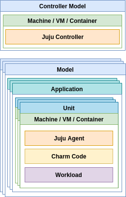
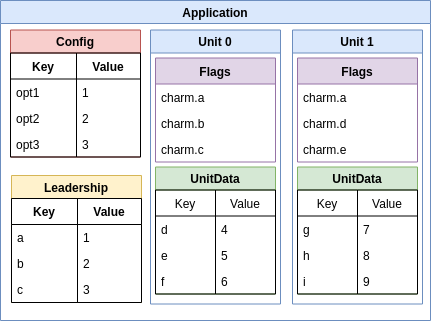
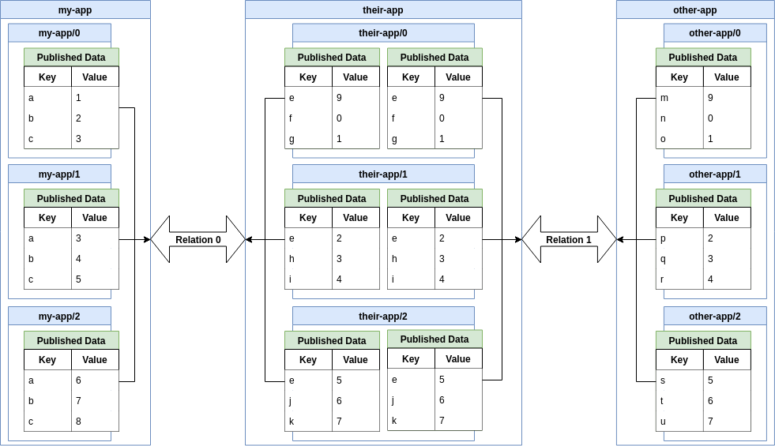

# Intro

This post will serve as a high-level overview of the concepts, architecture,
and design patterns of reactive charms and the framework that enables them.  It
is intended to help someone who is familiar with Python programming to come to
terms with the specific patterns used in reactive charms.

# Operating Software in the Cloud

While not new, the complexity of managing applications and dealing with the
problems of failure at the level of hardware, networking, storage, etc. at
scale has been brought into sharp focus by working in the cloud.  Juju helps
deal with this complexity by providing a conceptual model of applications,
their interconnections, groupings, and other aspects along with tools to
practically interact with software using this conceptual model, as well as a
way to encapsulate operational expertise in an extremely reusable way.  In a
sense, it is "open-sourcing operational knowledge".

Charms represent the operational expertise around a single application,
including how that application should be deployed, connected to other
applications, and managed over time.  Because the operational knowledge of a
given application is encapsulated in a charm, Juju can manage deployments of
charms without having specific knowledge of the individual applications, and
the charms can be reused in many different deployments across many different
types of clouds or infrastructures.  Further, because the encapsulation of the
charm includes how that charm relates to other applications via well-defined
interface protocols, very complex software deployments can be managed through
extendable, but well-defined mechanisms.

For more efficient code reuse, charms are further broken down into layers,
which are pieces brought in from various locations and shared between charms,
as well as reactive handlers, which are small Python functions triggered by
conditions on flags, which in turn are an extendable collection of set /
not-set markers used to track state or represent events in the charm, based
on the hooks run or work done by the charm.

# The Juju Controller and Model

In order to deploy and manage applications with Juju, you have to have a
controller.  This is essentially an application that maintains the conceptual
models and specific machines and data about those machines which comprise those
models.  This controller can be bootstrapped from scratch into a machine or VM,
or it can be a shared controller used by a few organizations or even anyone
with an Ubuntu account (in the case of jujucharms.com).  This controller then
creates one or more models (a group of applications), and manages applications
deployed within those models.

When an application is deployed, the controller first locates the charm code
for that application, whether from the public Juju Charm Store, a private
enterprise charm store, or local path.  It then creates a unit of that
application, which is a single logical instance of that application for which
it allocates a machine, VM, container, pod, etc. to run on.  A Juju agent is
placed on the unit which connects to the controller and then handles the work
on the unit on behalf of the controller.  The agent loads the code of the charm
onto that unit, and a series of hooks, or life-cycle events are triggered in
the charm's code.

As the state of the model changes with other applications being deployed,
relations being made between applications, storage being assigned to
applications, etc. additional life-cycle hooks will be triggered in the charm
by the controller via the agent.

# Juju Charm Basics

Fundamentally, a charm is just a directory containing some metadata files,
executables that are invoked for each life-cycle hook that the controller will
trigger, and any other code or files needed to support that.

The metadata includes both informational data, such as the charm description
and maintainers, as well as functional data, such as the configuration options
and relation endpoints supported by the charm.  The most common metadata files
found in a charm are:

  * [`metadata.yaml`][]
  * [`config.yaml`][]
  * [`actions.yaml`][]
  * [`metrics.yaml`][]
  * [`layer.yaml`][]
  * [`wheelhouse.txt`][]
  * [`icon.svg`][]

[`metadata.yaml`]: https://docs.jujucharms.com/stable/authors-charm-metadata
[`config.yaml`]: https://docs.jujucharms.com/stable/charms-config
[`actions.yaml`]: https://docs.jujucharms.com/stable/developer-actions
[`metrics.yaml`]: https://jujucharms.com/docs/stable/developer-metrics
[`layer.yaml`]: https://docs.jujucharms.com/stable/reference-layer-yaml
[`wheelhouse.txt`]: https://charmsreactive.readthedocs.io/en/latest/layer-basic.html#wheelhouse-txt-for-charm-python-dependencies
[`icon.svg`]: https://docs.jujucharms.com/stable/authors-charm-icon

The executable code in a charm is generally found in one of the following
directories:

  * `hooks/`
    These are the [low-level lifecycle executables][hooks] invoked directly by
    the Juju agent.  These hooks are very coarse-grained, informing the charm
    of high-level events such as "this is the first install", or "some
    configuration has changed".  They are only invoked once per event and it is
    up to the charm code to manage any state needed to keep track of which
    hooks have fired, what work the charm did based on that, and what the state
    of the system is.  This is usually managed automatically by the
    [reactive framework][].

  * `reactive/`
    This is where Python code that is to be invoked by the [reactive framework][]
    is placed.  This is where the much smaller, more application focused handlers
    will go.  By convention, each layer has a single Python module, as a file or
    directory, named after the name of the layer (with any dashes converted to
    underscores).

  * `lib/`
    This is where the charm can include bundled helper libraries, which may be
    shared between [layers][].  This directory is automatically added to the
    Python path.  By convention, each layer may include a Python module in
    this directory, with the full Python import path being
    `charms.layer.{layer_name}`, where `{layer_name}` is the name of the layer
    with any dashes changed to underscores.  This layer module can be used
    to expose functions or classes to other layers as part of the layer's API.

  * `lib/exec.d/`
    This is where [pre-bootstrap initialization code][exec.d] can go.  This
    code is run once only, before anything else in the charm, and is intended
    to extend the bootstrap process on a per-charm basis.

In theory, charms can be written in any language, but in practice Python has
been settled on as the language of choice, with the two main support libraries,
[charmhelpers][] and [charms.reactive][] being Python.

[hooks]: https://docs.jujucharms.com/stable/reference-charm-hooks
[layers]: #reusing-code-layered-charms
[reactive framework]: https://charmsreactive.readthedocs.io/
[exec.d]: https://charmsreactive.readthedocs.io/en/latest/layer-basic.html#exec-d-support
[charmhelpers]: https://charm-helpers.readthedocs.io/
[charms.reactive]: https://charmsreactive.readthedocs.io/

# Reusing Code: Layered Charms

Typically charms share a lot of common functionality, especially when
considering relations and their interface protocols where it is critical for
both sides to agree on how to communicate.  There are many ways that this
common code could be shared, but for various reasons, such as the fact that
it is often necessary to combine several non-code files together, such as
fragments for the `metadata.yaml`, `config.yaml`, or `wheelhouse.txt` files,
as well as to minimize boilerplate needed to get started, the layered charm
approach was settled on.

This approach is similar to how Docker images are built by layering filesystem
images on top of other images, but for charms instead works on a per-file
basis.  By specifying a list of included layers in the [`layer.yaml`][] file,
the charm combines the file contents of those layers, and any layers which they
themselves include, recursively, using a set of [build tactics][].  These
tactics determine whether a file in a layer replaces or is merged with a
corresponding file from a previous layer, as well as how exactly the merge is
applied.

These layers can then work together by providing an API consisting of Python
code and reactive flags (see below), as well as defining layer options which
can be used to influence their behavior.

One particularly important use of layers is to encapsulate the data exchange
protocol of relation interfaces.  These interface layers provide a higher level
Python API for the relation and to ensure that all charms implement the
interface protocol in the same way.  This ensures that charms which claim to
support a given interface protocol can all reliably speak to each other.  It
also allows the interface layer maintainer to have a way to evolve the protocol
over time, since the interface layer can contain code to negotiate a commonly
supported protocol version and handle upgrading an existing conversation from
one version to another.

[`layer.yaml`]: https://charm-tools.readthedocs.io/en/latest/tactics.html#charmtools.build.tactics.LayerYAML
[build tactics]: https://charm-tools.readthedocs.io/en/latest/tactics.html

# Tracking and Reacting to the Lifecycle: Flags and Handlers

Juju informs a charm of changes to its lifecycle and state by triggering hooks
which represent specific events, such as config options being changed by the
operator, or new data being available on a relation.  However, there is
impossible to know in what order these events will happen, since it will depend
on external factors such as VM allocation time, network latency, and operator
actions.  Further, charms will generally need to act on some combination of
several of these events and specific data being available.  Performing a full
inspection of the state of the system each time to determine what action to
take is prohibitive and complicates the logic of the charm.

The reactive framework enables charms to track the state of the system by
setting flags to represent certain conditions having been met.  The charms can
then trigger functions, called handlers, to run or not based on some
combination of these flags in a declarative way.  In a sense, the combination
of flags and handlers allow charms to extend the language of Juju hooks to
include application specific events.

Flags are simply strings which represent boolean indicators which can either
be set or cleared.  The framework manages a set of [automatic flags][] which
represent changes to the state provided by Juju itself.  The charm and
individual layers can set additional, arbitrary flags to represent internal
state, or if documented, flags can be used to communicate changes in state
from one layer to another and trigger behavior in the other layers via
handlers.

Handlers are then regular Python functions which are decorated with
some combination of [`@when`-type decorators][decorators].  During each
hook invocation, all handlers have the flag conditions specified by their
decorators checked against the current set of flags, and the ones which
match are called.  This process is repeated to pick up any changes to
the flags, until no new handlers match, at which point the hook terminates.

Note that the convention for flags is to use dotted namespacing to avoid
conflicts.  So, `charm.flag` would be a flag set by the charm layer,
`layer.foo.flag` would be a flag set by layer foo, `endpoint.bar.flag`
would be a flag associated with the bar endpoint managed by an interface
layer, and so on.  (A single interface layer might handle multiple named
relation endpoints, if the charm defines multiple relations which use
the same interface protocol.  However, the flags would be associated with
the specific endpoint name, rather than the interface protocol, and thus
layer, as a whole.)  Additionally, since the conditions for handlers can
grow complex, it is often helpful to distill complex conditions down to
a single flag.

[automatic flags]: https://charmsreactive.readthedocs.io/en/latest/managed-flags.html
[decorators]: https://charmsreactive.readthedocs.io/en/latest/charms.reactive.decorators.html

# Other Types of Data and State

In addition to flags to track boolean state, charms will need to store and
communicate structured data.  There are multiple key-value stores for various
types and purposes of data used by the charm.  At the application level,
there is config and leadership data.  At the individual unit level, there
are reactive flags and the unitdata store.  And connecting applications,
there is relation data.

## Config Options

The configuration options defined by the charm can be set by the operator or
bundle, and are used to pass data into the charm.  The values for the config
options are application-wide (that is, they are the same for every unit), and
cannot be modified by the charm.  The values of the config options can be basic
strings, numbers, or booleans.  There are [automatic flags][] available for
reacting to changes to this data.  This data is stored in the controller.

## Leadership Data

This KV store can only be written by the unit designated by Juju as the leader,
but it can be read by any unit of the application.  If the non-leader units
need to communicate data back to the leader, they must use the peer relation.
Values persist after leadership changes, with the new leader being able to add
or modify the data.  The values can only be simple strings, but values can be
JSON encoded before being set to store structured data.  There are [automatic
flags][] available for reacting to changes to this data.  This data is stored
in the controller.

## Unit Data

This KV is provided by the [charmhelpers][unitdata] library for a charm to
store structured data in.  As implied by the name, the data is unit-specific
and cannot be seen by any other unit.  The values can any JSON-serializable
data.  There are no automatic flags currently available to react to changes to
this data.  This data is stored in an sqlite database in the charm directory,
with permissions set to be only readable by the root user.

[unitdata]: https://charm-helpers.readthedocs.io/en/latest/api/charmhelpers.core.unitdata.html

## Relation Data

Relation data in Juju is more complex.  Each application can be related to
zero or more other applications, and a given named relation endpoint can be
connected multiple times (even potentially to the same remote application,
as long as different relation endpoints are used on the remote application).

For a given relation, each unit of an application gets a KV store to which it
can publish data.  It can then see the data it has published, as well as the
data that the units of the application on the other side of the relation have
published on the relation.

Generally, the low-level KV data is not used directly by the charm.  Instead,
the charm should rely on interface layers to manage the KV data and then
present a higher-level API in Python for managing communication with the
remote application, using those underlying KV data stores.
